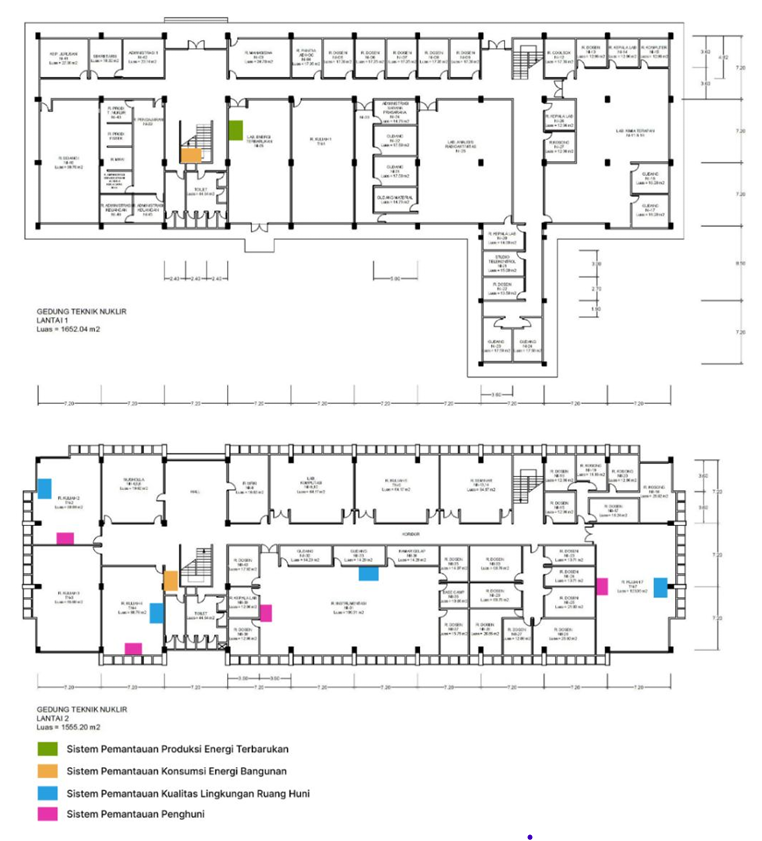
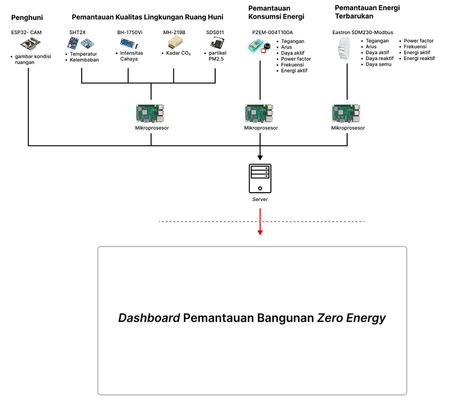
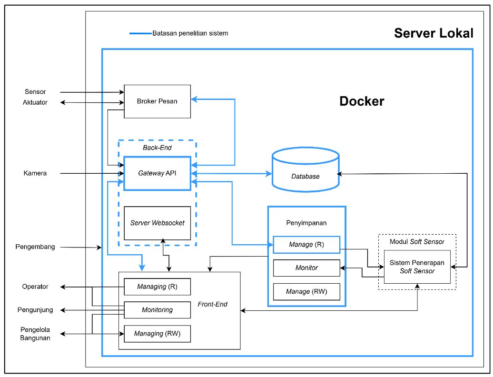
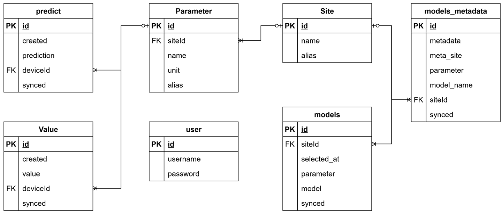
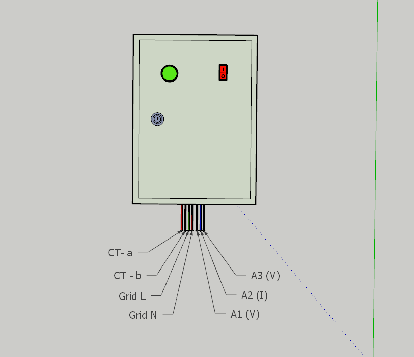

# Building Energy Management System (BEMS) – DTNTF UGM

This repository contains the backend system and deployment configurations for a Building Energy Management System (BEMS) designed to monitor Indoor Environmental Quality (IEQ) and energy consumption within buildings. This project supports DTNTF UGM's initiative towards achieving Zero Energy Buildings.

---

## Authors

- Dimas Fredy Prakasa  
- Edina Tri Susilo  
- Gilang Qhismu Adjie
- **Kendra Khairan Ajie** *(repository owner)*
- Muhammad Faiq Irhab  
- Muhammad Itqon Alexander  
- Shaki Saptiadi Putra

---

## Project Scope

This system is developed specifically for **local deployment at the Department of Nuclear Engineering and Engineering Physics (DTNTF), Universitas Gadjah Mada**, in several classrooms and laboratories.

### Deployment Area

The following map shows the local deployment area of the system:

---

## System Architecture

The BEMS consists of physical sensors and soft-sensors for monitoring parameters related to energy usage and indoor environmental quality (IEQ), such as temperature, humidity, light intensity, and CO₂ concentration.

### System Diagram

---

## Backend Scope and Responsibilities

This repository contains the **backend portion** of the BEMS project, including:

- Development of **RESTful API** for data access and control
- **Database schema and management**
- Integration with **MinIO object storage** for sensor data and file storage

### Backend Boundaries and Focus

---

## Entity Relationship Diagram (ERD)

The ERD below shows the structure of the backend database used to manage sensors, devices, room metadata, and measurement records.

---

## Hardware Contribution

In addition to backend development, the repository owner was also responsible for designing a 3D model of the physical **energy consumption monitoring box**.

---

## License

This project is intended for academic and educational use only, specifically for deployment at DTNTF UGM.
